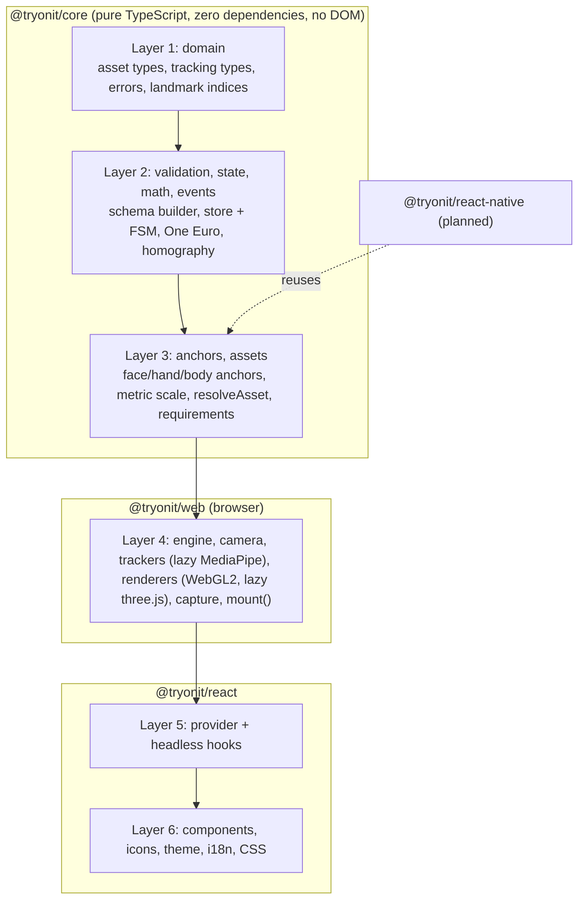
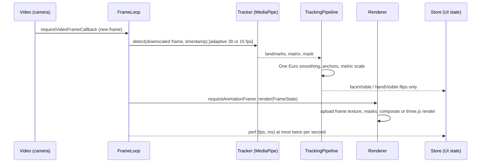
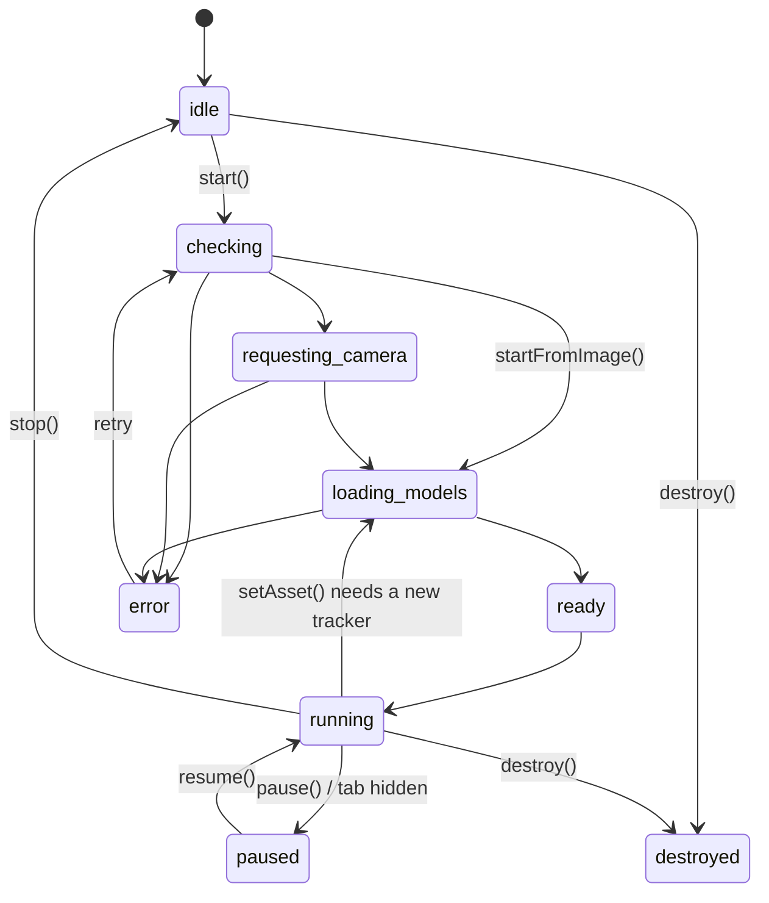

# Architecture

TryOnIt is a layered monorepo. Each layer may only import from layers with a lower number. ESLint (`no-restricted-imports`) enforces this in `eslint.config.js`.

## Why core is platform agnostic

`@tryonit/core` contains everything that does not depend on a browser: manifest types and validation, the session store and finite state machine, anchor math, smoothing filters and the asset resolver. It is compiled with `lib: ["ES2022"]` and no DOM types, uses an injectable `fetch`, never touches `window`, `document` or `navigator`, and is tested in a Node environment without DOM globals (`packages/core/test/no-dom.test.ts`). This lets a future React Native package reuse it unchanged.

## Data flow per frame

Key rules:

- **Per frame data never enters the store.** Landmarks, anchors and masks flow through the fast path (`TrackingPipeline` and `FrameState`). The store only holds UI relevant state, so React re-renders stay rare.
- **Render every frame, detect when needed.** Detection runs once per new camera frame at an adaptive rate. Rendering uses the latest smoothed pose on every animation frame.
- **Tracking loss** keeps the last pose for 300 ms with a fade out, then hides the product and flips `tracking.faceVisible` to false, which shows the "look at the camera" hint.

## Lazy loading

`getAssetRequirements(asset)` maps every asset type to the trackers and renderers it needs:

| Asset types                  | Trackers  | Renderer           | Chunks loaded                               |
| ---------------------------- | --------- | ------------------ | ------------------------------------------- |
| `makeup.*`                   | face      | makeup (WebGL2)    | MediaPipe runtime, face model, GL renderers |
| `hair.color`                 | segmenter | hair (WebGL2)      | MediaPipe runtime, hair model, GL renderers |
| `face.overlay2d`             | face      | overlay2d (WebGL2) | MediaPipe runtime, face model, GL renderers |
| `glasses`, `hat`, `earrings` | face      | three              | MediaPipe runtime, face model, three.js     |
| `watch`, `ring`              | hand      | three              | MediaPipe runtime, hand model, three.js     |
| `clothing.top`               | pose      | overlay2d (WebGL2) | MediaPipe runtime, pose model, GL renderers |

Switching from one lipstick to another lipstick loads nothing new. Trackers and renderers are kept warm until `destroy()`.

## Session state machine

Invalid transitions are ignored (and logged in debug mode). The full table lives in `SESSION_TRANSITIONS` (`packages/core/src/state/session.store.ts`) and is unit tested for every pair of states.

## Rendering

- **Makeup** (`renderers/makeup-renderer.ts`): for each layer, region polygons built from face landmarks (`makeup-geometry.ts`) are rasterized into a half resolution mask, feathered with a separable Gaussian blur, then composited over the frame. The composite modulates the product color with the relative brightness of the underlying pixels so texture is preserved. Lips subtract the inner mouth polygon so teeth stay untouched.
- **Hair** (`hair-renderer.ts`): the segmentation mask drives a recolor that keeps the original luminance pattern.
- **2D overlays** (`overlay2d-renderer.ts`): face stickers are quads anchored to face points and rotated with head roll. Clothing is an 8 by 8 grid warped with a homography from four garment anchor points onto the detected torso.
- **3D** (`renderers/three/three-renderer.ts`, lazy): models are authored in millimeters and placed in centimeter camera space with a perspective camera that matches MediaPipe's face geometry (vertical FOV 63 degrees). Invisible depth only occluders (head ellipsoid, wrist and finger cylinders) hide parts that should be behind the body.
- **Mirroring** is a single CSS transform on the stage wrapper, so video, landmarks, GL and three.js layers always agree. Capture applies the same mirroring.

## Adding a new asset type in 6 steps

1. **Types** (`core/src/domain/asset.types.ts`): add the props interface, the `XAsset` alias and extend `AssetType` and `AssetManifest`.
2. **Validation** (`core/src/validation/manifest.schema.ts`): add a prop shape with defaults and register it in `assetSchemas` and `assetPropShapes`. The compiler checks that the schema output matches `AssetManifest`.
3. **JSON Schema** (`schema/manifest.v1.schema.json`): add a `oneOf` branch. `json-schema-sync.test.ts` fails until required fields, enums and defaults match.
4. **Requirements** (`core/src/assets/requirements.ts`): map the type to trackers and a renderer.
5. **Anchors and rendering**: add anchor math in `core/src/anchors` (pure and unit tested with fixtures) and handle the type in a renderer under `web/src/renderers` (or add a new lazily imported renderer in `engine/create-engine.ts`).
6. **Docs and samples**: document fields in `docs/MANIFEST_SPEC.md`, add a sample to `scripts/generate-sample-assets.mjs` and the catalog, and add UI hints in `StatusOverlay` if the type uses a new tracker.
